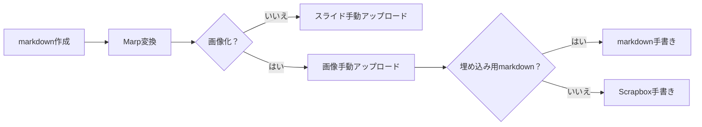
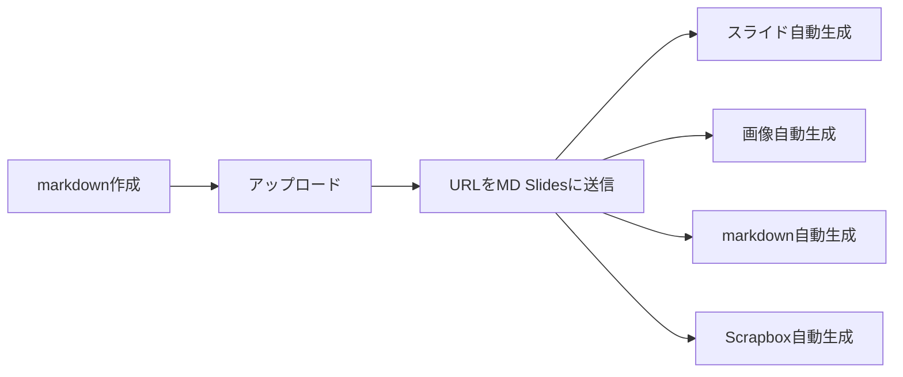

# MD Slides: お手軽スライド共有アプリ

本稿では、以下の4つの機能を実装したアプリケーション「MD Slides ( https://slides.deno.dev ) 」について紹介します。

- Markdown をスライド形式に変換して配信
- スライドの特定のページを画像として配信
- スライド全体を画像化し、Markdown形式で出力
- スライド全体を画像化し、Scrapbox形式で出力


従来のスライド作成のワークフローは以下のように、Markdownでスライドをつくってスライドと書き起しを共通化できても、最終段階の公開の部分やブログ貼り付け用のコードは手で作業する必要がありました。



このサービスによって Markdownの URLを渡すだけで、スライドも画像も貼り付け用コードもすべて自動生成してくれます。アップロードする必要もありません。



## Markdown をスライド形式に変換して配信

まずは、Markdown形式で資料を作成します。ページ区切りには `---` を用います。
このMarkdownファイルを適当なウェブサイト（たとえば GitHub Gist）に投稿することで、発表用スライドの原稿として共有できます。

```markdown
---
marp: true
---

# MD Slides: お手軽スライド共有アプリ

by tani

---

# MD Slides: お手軽スライド共有アプリ

以下の4つの機能を実装するアプリを作りました。

- Markdown をスライド形式に変換して配信
- スライドの特定のページを画像として配信
- スライドごとに画像化して Markdown 形式に埋め込む
- スライドごとに画像化して Scrapbox 形式に埋め込む

---

## Markdown をスライド形式に変換して配信

適当なMarkdownを書きます。ページの区切りには `---` が採用されています。
これを適当なウェブサイトに投稿しましょう。例えば、このmarkdownをGitHub Gistに投稿すれば発表スライドの原稿として共有可能です。
```

GitHub Gistでは「Raw」ボタンから直接MarkdownへのURLを取得できます。このURLを本アプリに入力することで、スライドとして変換・配信できます。


MD Slides（ [https://slides.deno.dev](https://slides.deno.dev) ）にアクセスし、MarkdownファイルのURLを入力後、「Generate」ボタンを押すとスライド配信用のURLが生成されます。


スライドは後述の通りMarpによりレンダリングされます。


この手順により、以下の2点が実現されます：

- Markdownによるスライド原稿の公開（例：GitHub Gist）
- スライドとしての配信（MD Slides 経由）

## スライドの特定のページを画像として配信

SNS等でのシェア目的で、スライドの一部ページだけを画像として抽出したい場合があります。その際は、MD Slidesにアクセスし、MarkdownファイルのURLを入力後、SVG形式と表示したいページを指定して「Generate」を押してください。画像として切り出されたページが配信用URLとして取得できます。


## スライド全体を画像化し、Markdown形式で出力

プレゼンテーション後に振り返り記事を執筆したい場合、各スライド画像をMarkdownに埋め込んだ形式で出力可能です。

この機能も、MD SlidesでMarkdownファイルのURLを指定し、「Generate」をクリックすることで利用できます。生成されたMarkdown形式のテキストをブログ記事等に貼り付けるだけで簡単に再利用可能です。


以下はGistに貼り付けた例です：


これでGistのPreviewでもスライドが表示されます。


## スライド全体を画像化し、Scrapbox形式で出力

Scrapboxユーザー向けにも、各スライド画像をScrapbox形式で出力する機能を提供しています。

同様に、MD SlidesにMarkdownファイルのURLを入力し、「Generate」を押すと、Scrapbox形式のテキストが生成され、それをコピー＆ペーストするだけで活用できます。


以下はScrapboxに貼り付けた例です：


## MD Slides の技術的構成

本アプリは以下の技術スタックに基づいて構築されています：

- **Marp**：MarkdownからスライドHTMLへの変換エンジン
- **JSDOM**：HTMLスライドから各ページを抽出する軽量なヘッドレスブラウザ
- **Deno Deploy**：ホスティングおよび変換・配信サーバー

以前はDenoとNodeの互換性が不十分であったためMarpが動作せず、このアイディアを保留していました。しかし現在では互換性が向上し、動作が確認できたため公開に至りました。

## 技術的に興味深い点：HTMLスライドの画像化

HTMLをPNG画像に変換するには、通常はPuppeteerのようなヘッドレスブラウザを使いますが、Deno Deployでは動作せず、リソース効率も良くありません。

そこで、SVG形式による画像化を採用しました。SVGはXMLベースのベクター形式であり、`<foreignObject>` 要素を使えばSVG内にHTMLを埋め込むことも可能です。
SVGがHTMLに埋め込めることを知っているひとは多いです。しかし、HTMLがSVGに埋め込めるのを意外に思う人は多いのではないのでしょうか。

これによりHTML文字列を `<svg>` と `<foreignObject>` で囲うだけで、そのまま画像データとして高速に配信できます。

### 配信手順概要

1. サーバーが指定されたMarkdownのURLから内容を取得  
2. MarpでHTMLスライドに変換  
3. JSDOMで各スライドページを抽出  
4. 指定ページを `<svg>` と `<foreignObject>` でラップし、SVG形式として配信  

この方式ではラスタライズを介さずに済むため、非常に高速な画像配信が可能になりました。

### 注意点：SVGと``要素の制限について

WebページでSVGを表示する方法には以下があります：

- `<object>`
- `<embed>`
- `<iframe>`
- ``

`` 要素ではセキュリティの観点から、SVG内の外部リソース（画像、フォント、スクリプト等）を読み込むことが制限されています。この仕様により、意図しない外部通信やスクリプト実行のリスクが抑えられます。

そのため、本アプリではCSS等を含むすべてのリソースをインライン化しており、外部リソースを必要としない構成を採用しています。

## まとめ：MD Slides を活用してスライド共有を効率化

「MD Slides」を利用することで、1つのMarkdown文書から以下の用途に展開できます：

- スライド形式でのプレゼン配信
- 特定ページの画像抽出と共有
- 各スライドの画像をMarkdown形式で再利用
- Scrapbox形式による知識管理への応用

なお、Deno Deployには帯域制限があるため、気に入っていただけた場合には、GitHub Sponsors によるワンタイム支援をご検討いただけますと助かります!

https://github.com/tani/slides
